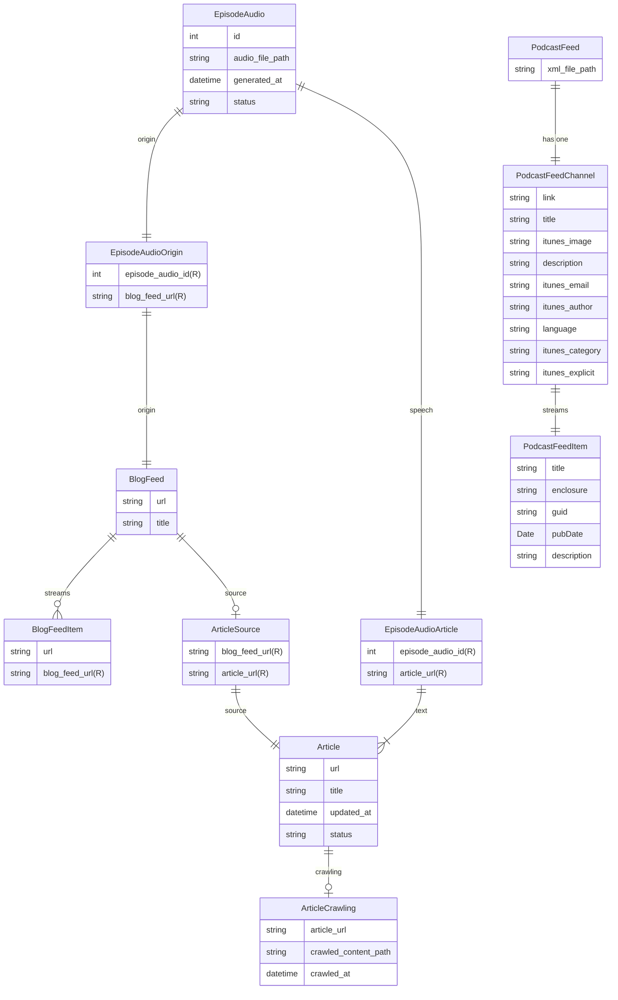

```mermaid
erDiagram

BlogFeed {
	string url
	string title
}
BlogFeedItem {
	string url
	string blog_feed_url(R)
}
Article {
	string url
	string title
	datetime updated_at
	string status
}
ArticleCrawling {
	string article_url
	string crawled_content_path
	datetime crawled_at
}
ArticleSource {
	string blog_feed_url(R)
	string article_url(R)
}
EpisodeAudio {
	int id
	string audio_file_path
	datetime generated_at
	string status
}
EpisodeAudioOrigin {
	int episode_audio_id(R)
	string blog_feed_url(R)
}
EpisodeAudioArticle {
	int episode_audio_id(R)
	string article_url(R)
}

PodcastFeed {
	string xml_file_path
}
PodcastFeedChannel {
	string link
	string title
	string itunes_image
	string description
	string itunes_email
	string itunes_author
	string language
	string itunes_category
	string itunes_explicit
}
PodcastFeedItem {
	string title
	string enclosure
	string guid
	Date pubDate
	string description
}

BlogFeed ||--o{ BlogFeedItem: "streams"
BlogFeed ||--o| ArticleSource: "source"
ArticleSource ||--|| Article: "source"
Article ||--o| ArticleCrawling: "crawling"
EpisodeAudio ||--|| EpisodeAudioOrigin: "origin"
EpisodeAudioOrigin ||--|| BlogFeed: "origin"
EpisodeAudio ||--|| EpisodeAudioArticle: "speech"
EpisodeAudioArticle ||-- |{ Article: "text"

PodcastFeed ||--|| PodcastFeedChannel: "has one"
PodcastFeedChannel ||--|| PodcastFeedItem: "streams"
```